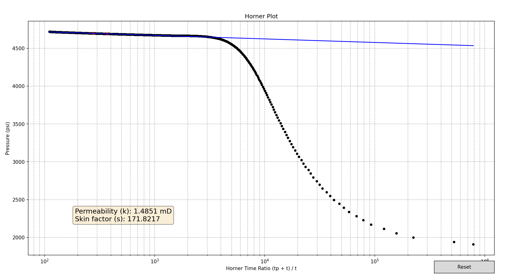
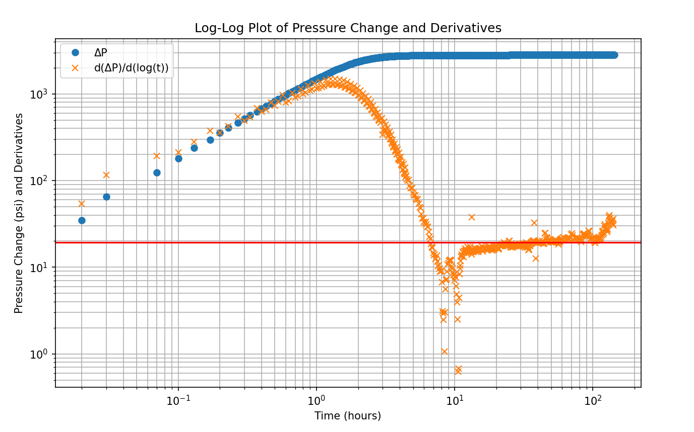

# Well Test Analysis Tool -buildup test

This tool performs well test analysis using Horner plots and Derivative plots. It's designed to help petroleum engineers analyze pressure buildup tests and determine key reservoir parameters.

## Features

1. **Horner Plot Analysis**
   - Interactive selection of points for slope calculation
   - Automatic calculation of permeability and skin factor
   - Real-time display of results

2. **Derivative Plot Analysis**
   - Log-log plot of pressure change (ΔP) and its derivative
   - Helps identify flow regimes and reservoir boundaries

## Horner Plot



The Horner plot is a semi-log plot of bottomhole pressure versus Horner time ((tp + Δt) / Δt). It's used to:

- Estimate initial reservoir pressure
- Calculate reservoir permeability
- Determine skin factor

## Derivative Plot



The pressure derivative plot is a log-log plot of ΔP and dP/d(log t) versus time. It's particularly useful for:

- Identifying flow regimes
- Detecting reservoir boundaries
- Diagnosing well and reservoir conditions

## How to Use

1. Run the script with your well test data.
2. In the Horner plot, click on two points to define the straight line portion.
3. The tool will automatically calculate and display permeability and skin factor.
4. A derivative plot will be generated based on your selection.

## Requirements

- Python 3.x
- NumPy
- Pandas
- Matplotlib
- Scikit-learn

## Installation

```bash
pip install numpy pandas matplotlib scikit-learn